# Bharat Mood 🇮🇳

**Bharat Mood** is a React Native mobile application designed to track the emotional pulse of India. Users can share their daily moods, post anonymous "vibes," and join city-based mood circles. The app features a beautiful, dynamic UI with dark mode support and gamification elements like streaks and badges.

## 🚀 Features

### 🎭 Mood Tracking
- **Daily Check-in**: Select your current mood (Happy, Stressed, Calm, etc.) via `DailyMoodScreen`.
- **Vibe Posts**: Share a short, anonymous text (max 100 chars) about how you feel.
- **Dynamic Location**: Automatically tags your city (e.g., "Bengaluru", "Mumbai") to your post.

### 🌍 Social & Community
- **Live Vibe Feed**: See what others across India are feeling in real-time on the `HomeScreen`.
- **Mood Circles**: Explore communities (`MoodCirclesScreen`) based on location or interest.
- **Community Details**: Deep dive into specific circles (`CommunityDetailScreen`), view members (`CommunityMembersScreen`), and join conversations.
- **Create Community**: Start your own circle (`CreateCommunityScreen`) to gather like-minded people.

### 🤝 Connections
- **Friends System**: Connect with others (`FriendsScreen`) and build your network.
- **Invite Users**: Grow your circle by inviting friends (`InviteUsersScreen`).
- **Search**: Find users and communities easily (`SearchScreen`).

### 👤 User Profile
- **Identity**: Choose a unique username (`UsernameInputScreen`) or generate a fun anonymous identity.
- **Profiles**: View your own stats (`ProfileScreen`) or check out others (`PublicProfileScreen`).
- **User Posts**: See a history of your shared vibes (`UserPostsScreen`).
- **Notifications**: Stay updated with interactions (`NotificationsScreen`).
- **Settings**: Manage your preferences and account (`SettingsScreen`).

### 🛠️ Tech Stack

- **Framework**: [React Native](https://reactnative.dev/) with [Expo](https://expo.dev/)
- **Language**: TypeScript
- **State Management**: [Zustand](https://github.com/pmndrs/zustand)
- **Navigation**: React Navigation (Native Stack & Bottom Tabs)
- **Backend**: Firebase (Auth & Firestore)
- **Location**: Expo Location
- **Icons**: Lucide React Native

## 📱 Screenshots

### Onboarding & Auth
<div style="display: flex; flex-direction: row; gap: 10px; overflow-x: auto; padding-bottom: 20px;">
   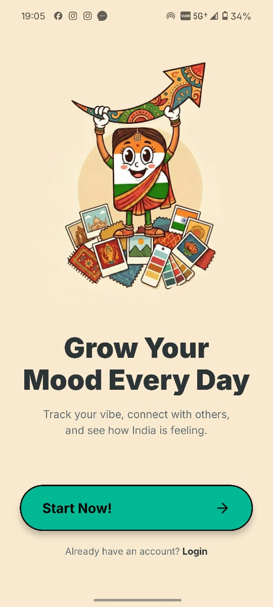
   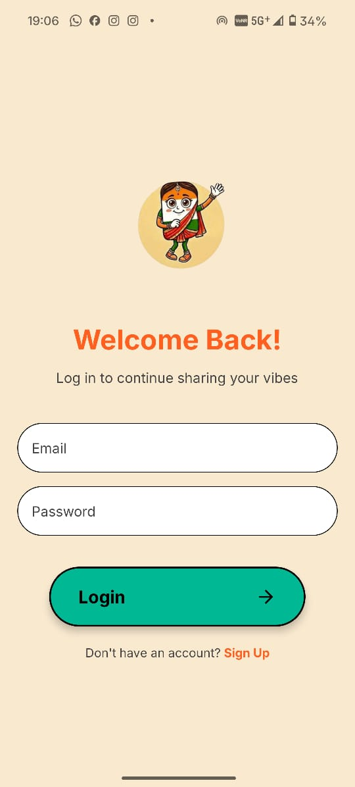
   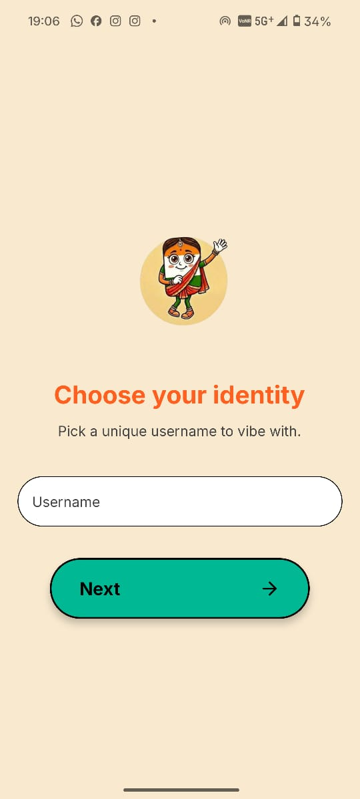
</div>

### Core Experience
<div style="display: flex; flex-direction: row; gap: 10px; overflow-x: auto; padding-bottom: 20px;">
   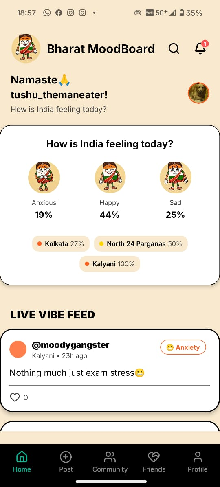
   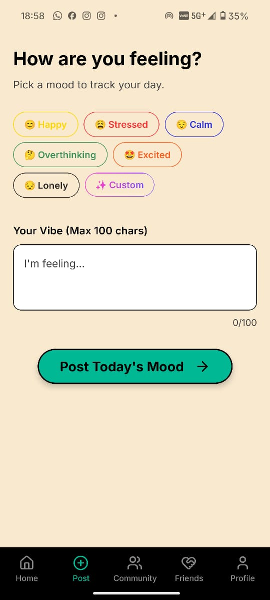
   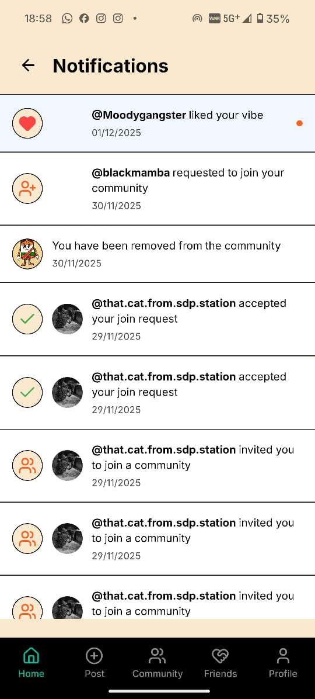
</div>

### Community & Social
<div style="display: flex; flex-direction: row; gap: 10px; overflow-x: auto; padding-bottom: 20px;">
   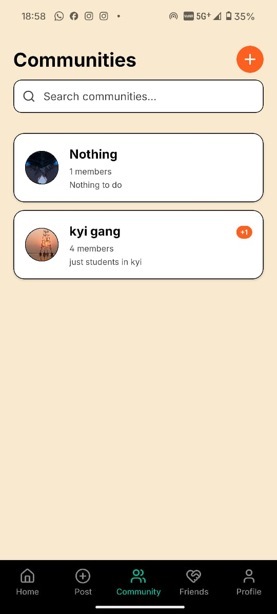
   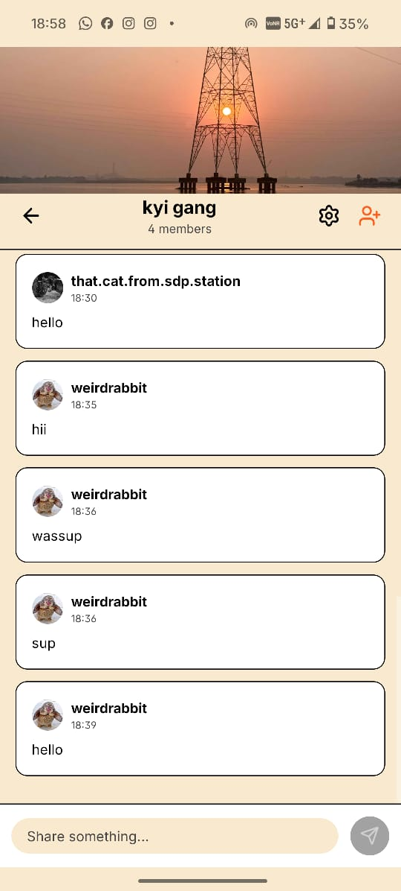
   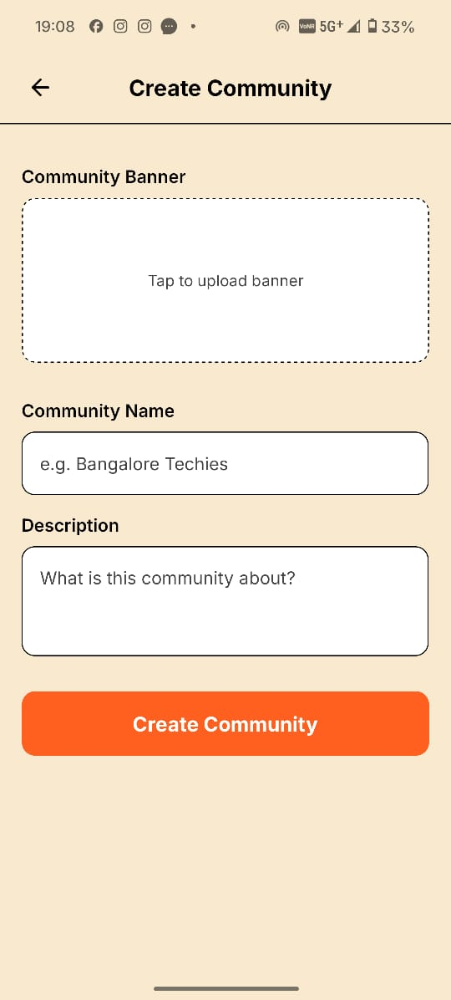
</div>

### Profile & Connections
<div style="display: flex; flex-direction: row; gap: 10px; overflow-x: auto; padding-bottom: 20px;">
   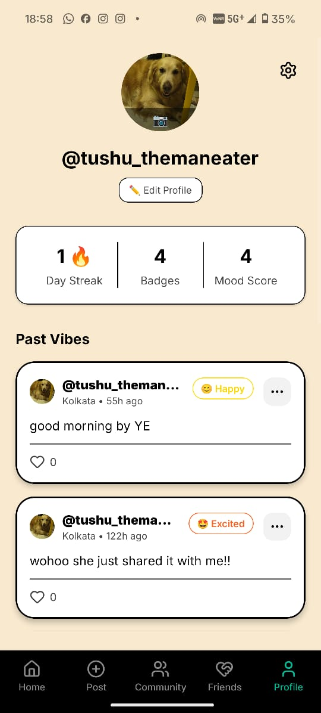
   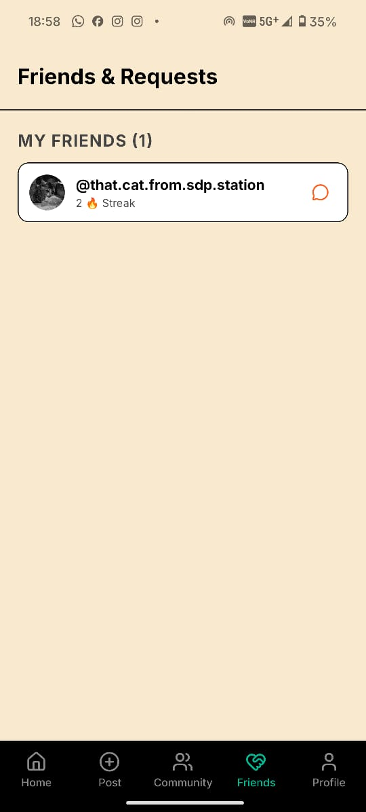
   
</div>

## 🏁 Getting Started

### Prerequisites
- Node.js (LTS version)
- npm or yarn
- Expo Go app on your physical device OR Android Studio/Xcode for emulation.

### Installation

1.  **Clone the repository**
    ```bash
    git clone https://github.com/yourusername/Bharat-Mood.git
    cd Bharat-Mood
    ```

2.  **Install dependencies**
    ```bash
    npm install
    # or
    yarn install
    ```

3.  **Configure Environment**
    Create a `.env` file in the root directory and add your Firebase credentials:
    ```env
    EXPO_PUBLIC_FIREBASE_API_KEY=your_api_key
    EXPO_PUBLIC_FIREBASE_AUTH_DOMAIN=your_project_id.firebaseapp.com
    EXPO_PUBLIC_FIREBASE_PROJECT_ID=your_project_id
    EXPO_PUBLIC_FIREBASE_STORAGE_BUCKET=your_project_id.appspot.com
    EXPO_PUBLIC_FIREBASE_MESSAGING_SENDER_ID=your_sender_id
    EXPO_PUBLIC_FIREBASE_APP_ID=your_app_id
    ```

4.  **Start the App**
    ```bash
    npx expo start
    ```
    - Scan the QR code with the **Expo Go** app (Android/iOS).
    - Press `a` to open in Android Emulator.
    - Press `i` to open in iOS Simulator.

## 📂 Project Structure

```
src/
├── components/     # Reusable UI components (VibeCard, ScreenWrapper, etc.)
├── config/         # Firebase and other configurations
├── constants/      # Theme colors, fonts, and mock data
├── navigation/     # AppNavigator and TabNavigator setup
├── screens/        # Application screens (Home, Profile, Login, etc.)
├── services/       # Business logic (Auth, User, Location services)
├── store/          # Zustand global state store
└── types/          # TypeScript interfaces and types
```

## 🤝 Contributing

1.  Fork the repository.
2.  Create a new branch (`git checkout -b feature/AmazingFeature`).
3.  Commit your changes (`git commit -m 'Add some AmazingFeature'`).
4.  Push to the branch (`git push origin feature/AmazingFeature`).
5.  Open a Pull Request.

## 📄 License

Distributed under the Apache License, Version 2.0. See `LICENSE` for more information.
